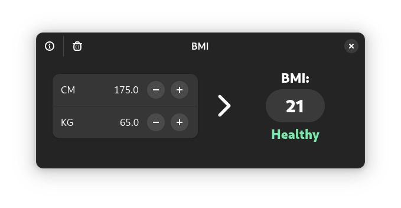

# BMI
BMI is an open-source, body mass index calculator built with GTK4 and LibAdwaita.

# Install

Or via [Github Releases](https://github.com/PhilippKosarev/bmi/releases)

# Contribute
The project is built using [Gnome Builder](https://apps.gnome.org/en-GB/Builder/).
