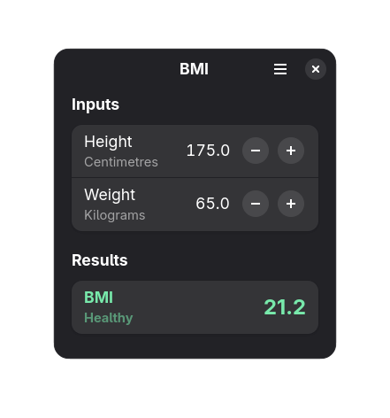

<h1>BMI</h1>

BMI is an open-source, body mass index calculator built with GTK4 and LibAdwaita.

<h1>Installing</h2>

Available on <a href='https://flathub.org/apps/details/io.github.philippkosarev.bmi'>Flathub</a>.
</a>

and via <a href='https://github.com/PhilippKosarev/bmi/releases'>Github Releases</a>.

<h1>Building</h2>
This project is built using <a href='https://apps.gnome.org/en-GB/Builder'>Gnome Builder</a>.

You can also manually run the meson commands to install and run the app natively.
<pre>
meson setup build
cd build
meson compile
meson install
bmi
ninja uninstall
</pre>
or just run <code>./run.sh</code> which does that for you.

