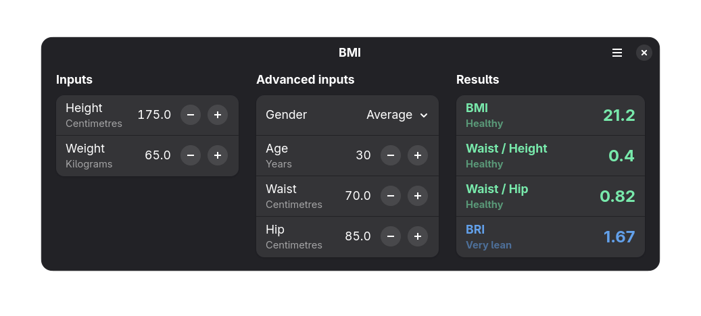

<h1>BMI</h1>

BMI is an open-source, body mass index calculator built with GTK4 and LibAdwaita.



<p>
<h2>Installing</h2>
<p>
Available on <a href='https://flathub.org/apps/details/io.github.philippkosarev.bmi'>Flathub</a>.
</a>
<p>
<a href='https://flathub.org/apps/details/io.github.philippkosarev.bmi'>

</a>
</p>
and via <a href='https://github.com/PhilippKosarev/bmi/releases'>Github Releases</a>.
</p>

<p>
<h2>Building</h2>
This project is built using <a href='https://apps.gnome.org/en-GB/Builder'>Gnome Builder</a>.

<h3>Dependencies</h3>

- python
- PyGObject
- blueprint-compiler
- flatpak-builder

<h3>Running</h3>

Use the project's runner script:
```sh
./run native # Native build
./run flatpak # Flatpak build
```
or manually run the commands from `run-config.toml`.